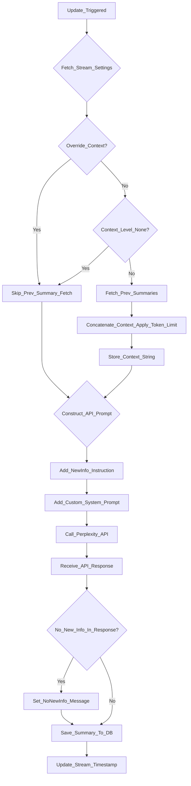
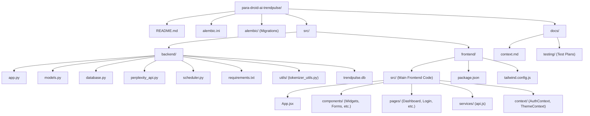

# TrendPulse Dashboard

TrendPulse Dashboard is a customizable web application that empowers users to track evolving topics of interest. It functions like an AI-powered, personalized feed reader, where users create "Topic Streams" for any subject. TrendPulse then leverages Perplexity Sonar AI to deliver concise, AI-generated summaries with citations, allows interactive follow-up questions, and provides configurable real-time updates—all within a dynamic dashboard interface.

## Demo


*May 21 2025 v2.5 UI Refresh by @DailyFocus - coming soon™️*


*May 11th 2025 v1 TrendPulse Dashboard, showing mobile feed view, list view, and grid view, while Update Stream is run and returns a new summary.*

## Core Features

### Topic Stream Management (Your Personalized AI Feeds)
-   **Create & Customize Streams:** Define personalized topic streams (your custom feeds) for any subject or query.
-   **Update Configuration:**
    -   Set update frequency (hourly, daily, weekly).
    -   Configure detail level for summaries (brief, detailed, comprehensive) - *backend dynamically adjusts `max_tokens` for Perplexity API.*
    -   Choose from multiple Perplexity models (e.g., `sonar`, `sonar-pro`, `sonar-reasoning`, `sonar-reasoning-pro`, `sonar-deep-research`) for summary generation.
    -   Define recency filters for time-sensitive information (e.g., last hour, day, week).
    -   Adjust AI temperature for summary generation.
    -   Set the depth of historical context (previous summaries) to be considered for new updates.
    -   Toggle automatic updates on or off per stream.
-   **View & Organize:** Manage your streams in a clear list or grid view on the dashboard.

### Real-time Summaries & Updates
-   **AI-Powered Summarization:** Receive AI-generated summaries for your topic streams, backed by Perplexity's search capabilities.
-   **Source Citations:** Summaries include transparent source citations for verification.
-   **Update History:** Access a history of summaries for each topic stream, tracking its evolution.
-   **`<think>` Tag Masking:** AI "thought" processes within summaries (if generated by the model using `<think>` tags) are initially hidden and can be expanded by the user for deeper insight into the generation process.
-   **Token Usage Display:** View estimated and actual token usage for generated summaries, providing insight into API consumption.

### Interactive Deep Dive & Q&A
-   **Follow-up Questions:** For any summary, engage in an interactive Q&A session to delve deeper into specific aspects.
-   **Context-Aware Responses:** The AI considers the context of the parent summary and previous questions in the deep dive session.
-   **Selectable AI Models for Chat:** Choose the AI model (`sonar`, `sonar-pro`, `sonar-reasoning` (default), `sonar-reasoning-pro`, `sonar-deep-research`) for tailoring deep-dive chat responses. *The backend uses extended timeouts for `sonar-deep-research` in chat.*
-   **Markdown Rendering:** All summaries and chat messages are rendered with Markdown, including syntax highlighting for code.

### View Modes
-   **Dashboard View (List Layout):** Traditional list-based layout for displaying topic streams and their detailed summaries.
-   **Grid View:** A widget-based layout displaying topic streams as cards. Features card styling and responsive grid considerations.
-   **Mobile Feed View:** A chronological feed of all summaries from all active streams, optimized for mobile devices.

### Professional UI Design
-   **Modern Icon System:** Professional SVG icons from [Tabler Icons](https://tabler-icons.io/) replace emoji icons throughout the interface for a clean, modern aesthetic.
-   **Consistent Visual Language:** All interface elements use cohesive iconography including view mode toggles, action buttons, theme switching, and navigation elements.
-   **Apple-Style Sidebar Navigation:** 
    -   **Smooth Animations:** Collapsible sidebar with Apple's signature cubic-bezier easing curves (`cubic-bezier(0.4,0.0,0.2,1)`) for fluid open/close transitions.
    -   **Fixed-Width Design:** Maintains content integrity during animations - no stretching or squeezing of items.
    -   **Staggered Content Animations:** Header, stream list, and footer elements fade in with carefully timed delays for polished visual flow.
    -   **Stream Status Indicators:** Color-coded freshness indicators (green=fresh, amber=recent, gray=stale) with hover tooltips.
    -   **Drag-and-Drop Reordering:** Intuitive stream reordering with grab handles, visual feedback, and smooth spring animations.
        -   **Precise Visual Insertion Indicators:** Single white pulse line shows exactly where items will be inserted during drag operations
        -   **Accurate Positioning:** Mouse position determines insertion point (above or below hovered items) with pixel-perfect accuracy
        -   **Real-time Feedback:** Insertion indicators update dynamically as you drag across different streams
        -   **Complete List Support:** Drop items anywhere in the list, including at the very bottom to append to the end
        -   **Single Line Display:** Prevents multiple insertion indicators for clean, unambiguous visual feedback
        -   **Seamless Positioning:** Enhanced mouse tracking enables dropping between any two items, at the beginning, or at the end
        -   **Container-Level Detection:** Advanced position calculation works in empty spaces and across the entire stream list
        -   **Consistent Drop Behavior:** Unified drop logic ensures reliable reordering regardless of where items are dropped
    -   **Quick Actions:** Update and delete buttons appear on hover with staggered slide-up animations.
    -   **Smart Navigation:** Click any stream to scroll to and highlight it in the main view while keeping all streams visible.
    -   **Keyboard Shortcuts:** Toggle sidebar with ⌘B (Command+B) for enhanced workflow efficiency.
    -   **Stream Counter:** Footer displays total stream count with smooth number transitions.
    -   **Responsive Design:** Slides over content on mobile, docked alongside on desktop with optimized touch targets.
-   **Responsive Design:** Icons and UI elements scale appropriately across desktop, tablet, and mobile viewports.
-   **Accessibility:** Proper ARIA labels and semantic markup ensure the interface is accessible to all users.

## Sonar Models Used in TrendPulse

TrendPulse leverages a suite of Perplexity Sonar API models to provide diverse functionalities:

-   **Topic Stream Summaries**:
    -   Users can select models like `sonar` (fast, cost-effective), `sonar-pro` (deeper, more citations), or `sonar-deep-research` (highly detailed, exhaustive research) when creating or editing a topic stream. The choice impacts the depth and cost of summary generation.
-   **Deep Dive / Chat (Follow-up Q&A)**:
    -   Users can select from the following models to tailor the chat experience:
        -   **`sonar`**: Quick follow-ups with fresh web searches.
        -   **`sonar-pro`**: More complex follow-ups needing deeper information and more citations.
        -   **`sonar-reasoning`** (Default): Multi-step reasoning, CoT responses, real-time web search.
        -   **`sonar-reasoning-pro`**: Premier reasoning for highly complex follow-ups, enhanced CoT, more citations, real-time web search.
        -   **`sonar-deep-research`**: Exhaustive web research, longer context window, extended processing time for in-depth exploration. *Backend uses an extended timeout for this model.*

## Technical Architecture

### Frontend
-   React-based single-page application.
-   TailwindCSS for responsive, utility-first styling.
-   React Router for navigation.
-   Context API (AuthContext, ThemeContext) for state management.
-   Markdown rendering with `react-markdown`, `remark-gfm`, and `rehype-raw`, including `<think>` tag masking via a custom `MaskedSection` component.
-   Responsive design for desktop, tablet, and mobile views.

### Backend
-   FastAPI (Python) for the API server.
-   SQLite database (`trendpulse.db` created locally in `src/backend/`) with SQLAlchemy ORM for data persistence.
-   Alembic for database schema migrations.
-   JWT-based authentication for user management.
-   Background task scheduling for topic stream updates using `APScheduler` (managed in `src/backend/scheduler.py`).
-   Dynamic `max_tokens` and timeouts for Perplexity API calls based on user selections and model types.
-   Direct integration with the Perplexity API using `aiohttp` for asynchronous calls.

## Dynamic Context for Focused Updates

TrendPulse employs a sophisticated context handling strategy to ensure that automated updates for Topic Streams focus on *new* information, avoiding repetition and providing users with genuinely fresh insights.

### How it Works:
1.  **User Configuration:** When creating or editing a Topic Stream, users can specify the `Context History Level`. This determines how much of the recent summary history (e.g., none, last 1, last 3, last 5, or a smart-limited selection of recent summaries) should be considered when generating a new update.
2.  **Recency Filtering:** The system always uses the Perplexity API's `search_recency_filter` (e.g., '1d' last day, '1w' last week) to limit the initial search scope to the desired timeframe.
3.  **Contextual Prompting:**
    *   If historical context is to be included (based on the user's setting and not overridden by a "force fresh update" manual trigger):
        *   The relevant previous summaries are fetched from the database.
        *   These summaries are concatenated (oldest first, with separators) into a single context string. This string is token-counted using `tiktoken` and truncated if it exceeds a predefined limit (currently ~20,000 tokens) to fit within the Perplexity API's context window.
        *   This historical context is then included in the prompt sent to the Perplexity API.
        *   The system prompt is dynamically adjusted to instruct the AI model to **"provide ONLY NEW information... that wasn't in the previous updates"** and **"DO NOT repeat information that was already covered."**
    *   If no historical context is used (e.g., `Context History Level` is 'None' or it's a forced fresh update), a more general prompt is used to summarize the topic based on the `recency_filter`.
4.  **Result:** This process aims to deliver incremental updates. If the AI finds no significant new information within the recency window that isn't already covered by the provided context, it's prompted to indicate this (e.g., "No new information is available since the last update.").

### Update Logic Flowchart:


This dynamic context management ensures that users receive relevant and non-redundant updates, making TrendPulse an efficient tool for tracking evolving topics.

## Development Setup

### Prerequisites
-   Python 3.9+ (for backend)
-   Node.js 18+ and npm (for frontend)
-   Perplexity API key (see API Keys section below)

### API Keys
1.  Sign up for the Perplexity API at [https://www.perplexity.ai/developer](https://www.perplexity.ai/developer)
2.  Copy your API key.

### Backend Setup
1.  Navigate to the project root directory.
2.  Create and activate a virtual environment:
    ```bash
    # For Windows (Powershell/CMD)
    python -m venv .venv
    .\.venv\Scripts\activate

    # For macOS/Linux (bash/zsh)
    # python3 -m venv .venv
    # source .venv/bin/activate
    ```
3.  Install backend dependencies:
    ```bash
    pip install -r src/backend/requirements.txt
    ```
4.  Set your Perplexity API key as an environment variable.
    *   **Recommended:** Create a `.env` file in the `src/backend/` directory (it's in `.gitignore`). Add the following line:
        ```
        PERPLEXITY_API_KEY="your_api_key_here"
        ```
    *   Alternatively, set it in your shell (e.g., for Powershell):
        ```powershell
        $env:PERPLEXITY_API_KEY="your_api_key_here"
        ```
5.  **Database Setup:**
    *   The SQLite database file (`trendpulse.db`) will be **automatically created** in the `src/backend/` directory when you first run the backend server if it doesn't already exist. The necessary tables will also be created automatically by SQLAlchemy based on `src/backend/models.py`.
    *   **Database Migrations (Alembic):** Alembic is used to manage changes to the database schema *after* its initial creation.
        *   The Alembic configuration is in `alembic.ini` (project root) and `alembic/env.py`.
        *   To apply migrations (e.g., after pulling changes that include new migration scripts):
            ```bash
            alembic upgrade head
            ```
        *   To create a new migration script after changing `src/backend/models.py`:
            ```bash
            alembic revision -m "your_description_of_changes" --autogenerate
            ```
            Then review and edit the generated script in `alembic/versions/` before applying.
6.  Run the backend server (from the project root):
    ```bash
    python src/backend/app.py
    ```
    The backend will typically run on `http://127.0.0.1:8000`.

### Frontend Setup
1.  Navigate to the frontend directory:
    ```bash
    cd src/frontend
    ```
2.  Install frontend dependencies:
    ```bash
    npm install
    ```
3.  Run the frontend development server:
    ```bash
    npm start
    ```
    The frontend will typically run on `http://localhost:3000` and proxy API requests to the backend at `http://localhost:8000`.

## Usage

1.  **Register and Log In:** Create an account and log in to access your dashboard.
2.  **Create Your Personalized Feeds (Topic Streams):**
    *   Click "New Stream" or "Add New Topic Stream".
    *   Define your topic query (this becomes the basis of your custom, AI-curated feed).
    *   Customize settings: update frequency, detail level, Perplexity model for summaries, recency filter, temperature, context history depth, and whether automatic updates are enabled.
    *   Optionally provide a custom system prompt.
3.  **Read Your Feeds (Dashboard):**
    *   Your topic streams appear as widgets (list or grid view) or as a chronological feed (mobile/feed view).
    *   Each stream displays its latest AI-generated summary with source citations and update timestamps.
4.  **Interact with Summaries:**
    *   Click on a summary to expand it if truncated.
    *   Click "Deep Dive" (or similar) to open a chat interface for that summary.
5.  **Deep Dive Q&A:**
    *   Ask follow-up questions related to the summary.
    *   Select the desired AI model for chat responses.
    *   View context-aware answers with new citations if applicable.
    *   Optionally save insightful AI responses from the chat back to the stream's history.
6.  **Manage Streams:**
    *   Edit stream settings.
    *   Manually trigger an update ("Update Now").
    *   Delete streams.
    *   Export stream content (summaries and metadata) as `.txt` or `.md` files.

## Perplexity API Usage (Key Parameters)

The application primarily interacts with Perplexity's `/chat/completions` endpoint. Key parameters used include:
-   `model`: Dynamically set based on user selection for stream summaries (e.g., `sonar`, `sonar-pro`, `sonar-deep-research`) or deep-dive chat (e.g., `sonar-reasoning`).
-   `messages`: Constructed with a system prompt (default or custom), user query, and potentially concatenated previous summaries for context during stream updates. For deep-dive, it includes the chat history.
-   `search_recency_filter`: Set based on the stream's recency filter setting (e.g., 'day', 'week').
-   `web_search_options.search_context_size`: Adjusted based on the stream's detail level (e.g., 'medium', 'high').
-   `max_tokens`: Calculated based on detail level and whether the model is a reasoning type to ensure adequate response length.
-   `temperature`: User-configurable per stream for summary generation; a default is used for chat.

## Contributing

-   Follow the existing file structure and coding style.
-   Document new components and API endpoints clearly.
-   If making schema changes, generate and test Alembic migrations.
-   Update `docs/api_schema.xml` and `docs/data_model.xml` (if these are still actively maintained) with any significant changes.
-   Write clear commit messages and open pull requests for review.

## File Structure Overview
(Simplified - showing key directories)

