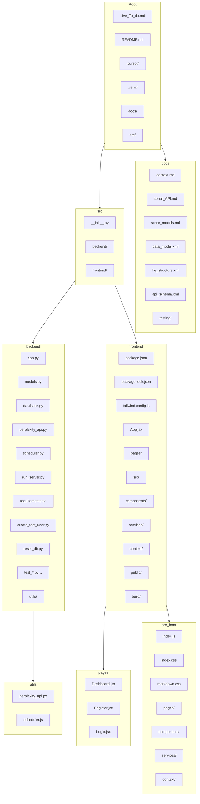

# TrendPulse Dashboard Frontend

This is the frontend application for TrendPulse, a platform for displaying and managing topic-based information feeds using the Perplexity API.

## Features

- User authentication (login/register)
- Create and manage topic streams
- View summaries with sources
- Deep dive for asking follow-up questions
- Responsive design using TailwindCSS

## Getting Started

### Prerequisites

- Node.js (v14 or higher)
- npm or yarn
- Backend server running (default: http://localhost:8000)

### Installation

1. Install dependencies:

```bash
npm install
# or 
yarn install
```

2. Start the development server:

```bash
npm start
# or
yarn start
```

The application will be available at http://localhost:3000.

### Environment Variables

You can customize the API URL by setting the `REACT_APP_API_URL` environment variable.

## Application Structure

- `/components` - Reusable UI components
- `/context` - React context providers
- `/pages` - Main application pages
- `/services` - API services for backend communication
- `/styles` - CSS and Tailwind configuration

## Backend Communication

The frontend communicates with the backend API for:

1. User authentication
2. Topic stream management
3. Retrieving summaries
4. Deep dive follow-up questions

## Technologies Used

- React
- React Router
- TailwindCSS
- Axios for API requests
- Date-fns for date formatting

